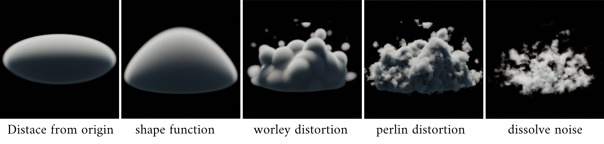

# OSL Cloud Generation

Procedural Cloud generation in OSL using a modular approach and as few parameters as possible to create a wide arrangement of cloud varieties.

## [**Show Paper (ger)**](./Prozedurale_Generierung_von_Wolkenin_Offline-Renderengines.pdf)

